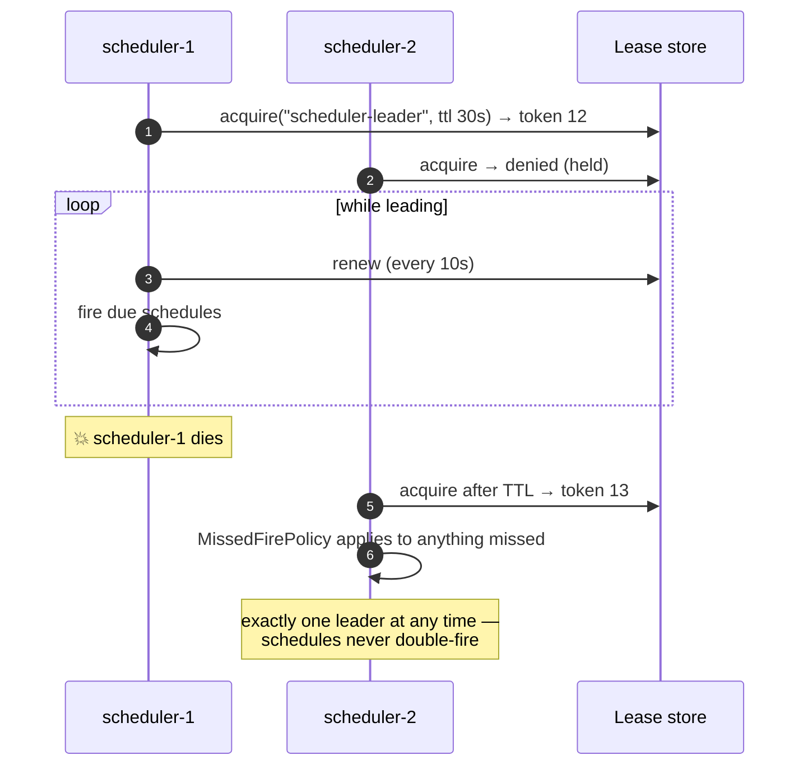

# Sample — Scheduled and recurring work

**Claim proved:** cron work is an ordinary flow. Leader election, overlap policy,
missed-fire recovery, per-tenant fan-out and DST correctness are platform
services, not job-framework glue.

## The flow

```csharp
[Flow("reconciliation.daily", Profile = ExecutionProfile.Durable)]
[CronTrigger("0 2 * * *",
    TimeZone   = "Europe/Berlin",       // DST-correct; never runs twice on the fall-back night
    Overlap    = OverlapPolicy.Skip,    // yesterday's run still going? skip today's
    MissedFire = MissedFirePolicy.RunOnce,
    Jitter     = "PT120S",              // spread load across replicas and tenants
    PerTenant  = true)]                 // fan out: one instance per active tenant
public sealed partial class DailyReconciliationFlow : Flow<ReconciliationRequest, ReconciliationReport>
{
    protected override void Define(IFlowBuilder<ReconciliationRequest, ReconciliationReport> flow) => flow
        .Step<LoadLedgerSnapshot>()
        .Step<LoadBankStatement>().WithPolicy(Policies.ExternalRead)
        .Parallel(p => p
            .Branch<MatchByReference>()
            .Branch<MatchByAmountAndDate>(),
         merge: MergeStrategy.AllSettled)
        .Step<ProduceReport>()
        .Emit<ReconciliationCompleted>()
        .Return(ctx => ctx.Get<ReconciliationReport>());
}
```

The same capabilities are reachable on demand — add `[HttpTrigger]` and an
operator can run reconciliation manually. Nothing about the flow changes.

## Leader election



## Policy semantics

| Option | Values | What it prevents |
|---|---|---|
| `Overlap` | `Skip` \| `Queue` \| `Concurrent` | a long run stacking on itself until the system dies |
| `MissedFire` | `Skip` \| `RunOnce` \| `RunAll` | a 2-hour outage producing 120 replayed minute-jobs at once |
| `TimeZone` | IANA id | the twice-yearly DST bug (double-run or skipped run) |
| `Jitter` | duration | 500 tenants all hitting the same downstream at 02:00:00 |
| `PerTenant` | bool | writing your own tenant loop, and forgetting isolation inside it |

## Tests

```csharp
[Fact]
public async Task Does_not_double_fire_when_the_leader_is_replaced()
{
    await using var cluster = await SchedulerCluster.CreateAsync(nodes: 3);
    await cluster.AdvanceTimeTo("02:00:00");
    await cluster.KillLeader();
    await cluster.AdvanceTime(TimeSpan.FromMinutes(1));

    cluster.Firings("reconciliation.daily").Should().HaveCount(1);
}

[Fact]
public async Task Skips_overlapping_runs_and_records_why()
{
    var host = SchedulerTestHost.For<DailyReconciliationFlow>().WithVirtualTime().Build();
    host.SimulateRunTaking(TimeSpan.FromHours(25));

    await host.AdvanceDays(2);

    host.Firings.Should().HaveCount(1);
    host.Metrics.Counter("flowx_schedule_skipped_total").Should().Be(1);
}
```

## Things to try

1. Set `Overlap = OverlapPolicy.Concurrent` and simulate a 25-hour run — watch
   instances stack, and see why `Skip` is the default.
2. Stop all schedulers for three hours and restart: compare `MissedFire` values
   `Skip`, `RunOnce` and `RunAll`.
3. Set the timezone to `America/New_York` and advance through a DST boundary —
   the 02:00 job neither runs twice nor disappears.
