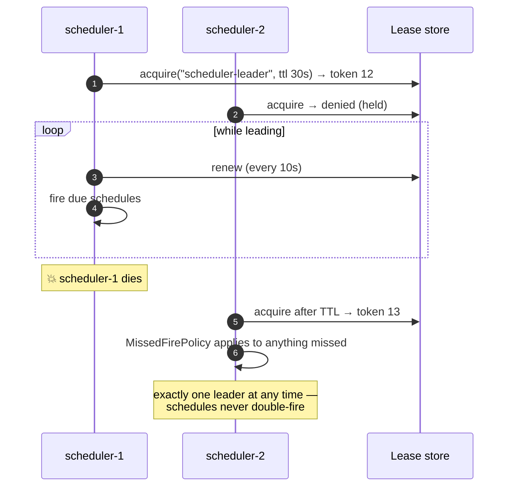

# Sample — Scheduled and recurring work

**Claim it is meant to prove:** cron work is an ordinary flow. Leader election,
overlap policy, missed-fire recovery, per-tenant fan-out and DST correctness are
platform services, not job-framework glue.

> [!NOTE]
> **The scheduler has since been built, and the warning box after this one is kept
> as written rather than edited.** *"There is no scheduler"* is false. A
> `[CronTrigger]` generates a registration, every node computes the same occurrence,
> and every node derives the same instance id from it — so a firing happens once
> across a cluster because the lease store and then the journal's primary key refuse
> the losers, which is leader election's outcome without a leader
> ([ADR-0031](../../docs/adr/ADR-0031-an-occurrence-names-the-instance-it-starts.md)).
> A firing that fell due while every node was down happens late.
>
> `samples/workflow`'s `offer.window.close` is that, running: no route, no hosted
> service, and no line in its `Program.cs` naming a time. `tests/Workflow.Tests/ScheduleTests`
> is where three replicas over one PostgreSQL are held to six firings rather than
> eighteen. `PerTenant` fan-out is served too, over the tenant registry at L2.
>
> **What is left is this page's larger claim**: `Overlap`, `MissedFire` and `Jitter`
> as declared options, and DST correctness stated rather than assumed.

> [!WARNING]
> **This sample has no code.** `samples/scheduler/` is this file and nothing else.
> **There is no scheduler.** Nothing anywhere in `src/` or `plugins/` reads a cron
> expression, computes a next firing, or starts a flow because a clock said so —
> the word *leader* appears exactly once in the whole of `src/` and `plugins/`,
> in the doc comment on `CronTriggerAttribute` promising the behaviour this page
> describes.
>
> `[CronTrigger("0 2 * * *", TimeZone = "Europe/Berlin")]` nevertheless
> **compiles**, and `EveryTriggerKindTheAbstractionShipsIsRecognised` asserts it
> reaches `flowx.manifest.json` as `"kind": "Schedule"`. Its cron expression and
> its time zone get that far.
> `Overlap`, `MissedFire`, `Jitter` and `PerTenant` do not: only
> `cron` and `timeZone` are read by `TriggerReader` and written by
> `ManifestWriter`, so the four options the [policy table](#policy-semantics)
> below is about are, today, defaults on an attribute nobody reads —
> `CronTriggerDefaultsProtectAgainstTheTwoClassicSchedulerIncidents` asserts the
> defaults are the safe ones and is the only thing that touches them.
>
> **The lease under the diagram is the part that exists.** `ILeaseStore` is
> declared, `DurableLease` acquires, renews and releases under a fencing token,
> and two stores implement it — `plugins/FlowX.Postgres` and `plugins/FlowX.Redis`
> — both passing `LeaseStoreConformance` unmodified
> ([11 §3](../../docs/11-Distributed-Runtime.md#3-leases-and-fencing)). What that
> lease is taken on is a *flow instance*, not a schedule. Electing one scheduler
> across N nodes is the same primitive pointed at a different key, and nobody has
> pointed it there.
>
> | What has to exist first | Where it comes from |
> |---|---|
> | A scheduler: next-firing computation, DST-correct time zones, a firing loop | **WP-75**, [P3](../../PLAN.md#6-p3--transport-breadth) |
> | Leader election over the existing lease store | **WP-75**, which depends on **WP-55** — *leader election is a lease, which is why P3 follows P2* |
> | `Overlap`, `MissedFire`, `Jitter` and `PerTenant` read into the manifest | Unassigned. The reader and the writer are three lines each; the semantics behind them are WP-75 |
> | `PerTenant` fan-out | **P6** — nothing consumes `TenantId` beyond carrying it ([16](../../docs/16-Multi-Tenant.md)) |
> | A retry policy that executes on a forward step | **P4.** Only `PolicySet.CompensationRetry` runs today, at `PolicyStage.Consistency`; the forward path runs zero policies |
>
> Read the rest as the design a P3 implementer is held to, not as behaviour you
> can observe.

## The flow

> **Compiles; never fires.** Every attribute below is real and the flow builds.
> Four of the five `[CronTrigger]` options are inert, and nothing starts the flow
> at 02:00 or at any other time. `.WithPolicy(Policies.ExternalRead)` on a forward
> step is recorded in the plan and the manifest and applies nothing at run time.

```csharp
[Flow("reconciliation.daily", Profile = ExecutionProfile.Durable)]
[CronTrigger("0 2 * * *",
    TimeZone   = "Europe/Berlin",       // DST-correct; never runs twice on the fall-back night
    Overlap    = OverlapPolicy.Skip,    // yesterday's run still going? skip today's
    MissedFire = MissedFirePolicy.RunOnce,
    Jitter     = "PT120S",              // spread load across replicas and tenants
    PerTenant  = true)]                 // fan out: one instance per active tenant
public sealed partial class DailyReconciliationFlow : Flow<ReconciliationRequest, ReconciliationReport>
{
    protected override void Define(IFlowBuilder<ReconciliationRequest, ReconciliationReport> flow) => flow
        .Step<LoadLedgerSnapshot>()
        .Step<LoadBankStatement>().WithPolicy(Policies.ExternalRead)
        .Parallel(p => p
            .Branch<MatchByReference>()
            .Branch<MatchByAmountAndDate>(),
         merge: MergeStrategy.AllSettled)
        .Step<ProduceReport>()
        .Emit<ReconciliationCompleted>()
        .Return(ctx => ctx.Get<ReconciliationReport>());
}
```

The same capabilities are reachable on demand — add `[HttpTrigger]` and an
operator can run reconciliation manually. Nothing about the flow changes.

## Leader election

> **The lease store in this diagram is built; the scheduler on either side of it
> is not.** `acquire`, `renew` and the TTL takeover at token 13 are exactly what
> `LeaseStoreConformance` asserts of both implementations. The two participants
> named `scheduler-1` and `scheduler-2` do not exist.



## Policy semantics

*Four of these five options are declared and unread — see the box at the top. The
table states what each one is for, which is why they were put on the attribute
before anything served them.*

| Option | Values | What it prevents |
|---|---|---|
| `Overlap` | `Skip` \| `Queue` \| `Concurrent` | a long run stacking on itself until the system dies |
| `MissedFire` | `Skip` \| `RunOnce` \| `RunAll` | a 2-hour outage producing 120 replayed minute-jobs at once |
| `TimeZone` | IANA id | the twice-yearly DST bug (double-run or skipped run) |
| `Jitter` | duration | 500 tenants all hitting the same downstream at 02:00:00 |
| `PerTenant` | bool | writing your own tenant loop, and forgetting isolation inside it |

## Tests

> **Neither test exists.** `SchedulerCluster` and `SchedulerTestHost` are in no
> file under `tests/` or `src/FlowX.Testing`, which ships `FlowTestHost` and a
> `WithClock(IClock)` seam — not `WithVirtualTime()`, and nothing that advances a
> cluster through a DST boundary. WP-75's exit criterion is the first of these two
> made real: *three nodes, one fire per tick, proven under a kill.*

```csharp
[Fact]
public async Task Does_not_double_fire_when_the_leader_is_replaced()
{
    await using var cluster = await SchedulerCluster.CreateAsync(nodes: 3);
    await cluster.AdvanceTimeTo("02:00:00");
    await cluster.KillLeader();
    await cluster.AdvanceTime(TimeSpan.FromMinutes(1));

    cluster.Firings("reconciliation.daily").Should().HaveCount(1);
}

[Fact]
public async Task Skips_overlapping_runs_and_records_why()
{
    var host = SchedulerTestHost.For<DailyReconciliationFlow>().WithVirtualTime().Build();
    host.SimulateRunTaking(TimeSpan.FromHours(25));

    await host.AdvanceDays(2);

    host.Firings.Should().HaveCount(1);
    host.Metrics.Counter("flowx_schedule_skipped_total").Should().Be(1);
}
```

## Things to try

*None of these can be tried yet — there is no project and no scheduler. Kept as
the acceptance list WP-75 is written to.*

1. Set `Overlap = OverlapPolicy.Concurrent` and simulate a 25-hour run — watch
   instances stack, and see why `Skip` is the default.
2. Stop all schedulers for three hours and restart: compare `MissedFire` values
   `Skip`, `RunOnce` and `RunAll`.
3. Set the timezone to `America/New_York` and advance through a DST boundary —
   the 02:00 job neither runs twice nor disappears.
