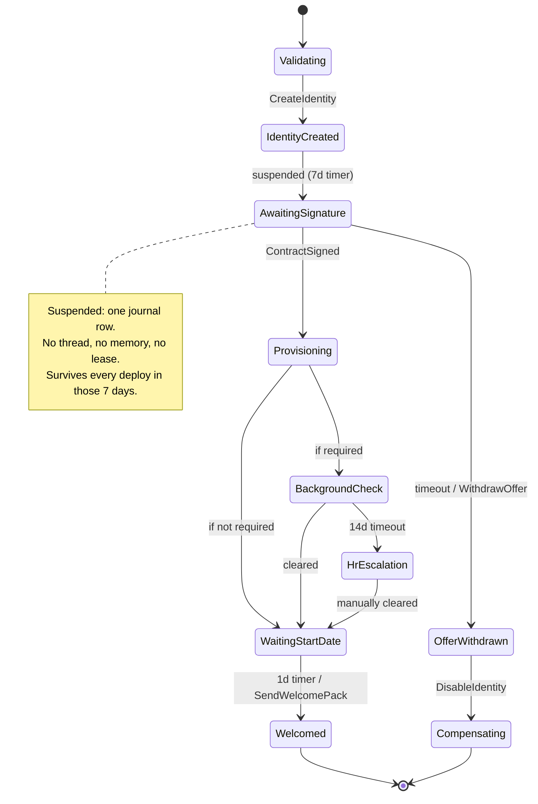
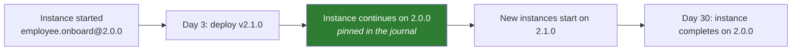

# Sample — Long-running human-in-the-loop process

**Claim proved:** a multi-day process with human approvals, escalations, timers
and reversible steps is **one readable file** — and it survives every deployment
that happens during those days.

## The flow

```csharp
[Flow("employee.onboard", Version = "2.0.0", Profile = ExecutionProfile.Durable)]
[FlowDeadline("P30D")]
[HttpTrigger("POST", "/api/v1/onboarding")]
public sealed partial class OnboardEmployeeFlow : Flow<OnboardEmployee, OnboardingResult>
{
    protected override void Define(IFlowBuilder<OnboardEmployee, OnboardingResult> flow) => flow
        .Step<ValidateOffer>()
        .Step<CreateIdentity>().CompensateWith<DisableIdentity>()

        .AwaitSignal<ContractSigned>(timeout: TimeSpan.FromDays(7))
            .OnTimeout(f => f.Step<WithdrawOffer>().Fail(OnboardingErrors.OfferExpired))

        .Parallel(p => p
            .Branch<ProvisionHardware>()
            .Branch<GrantSystemAccess>()
            .Branch<EnrolInPayroll>(),
         merge: MergeStrategy.AllMustSucceed)

        .When(ctx => ctx.Get<Offer>().RequiresBackgroundCheck, bg => bg
            .Step<StartBackgroundCheck>()
            .AwaitSignal<BackgroundCheckCleared>(timeout: TimeSpan.FromDays(14))
                .OnTimeout(f => f.Step<EscalateToHr>()))

        .Delay(TimeSpan.FromDays(1))                 // the day before the start date
        .Step<SendWelcomePack>()
        .Emit<EmployeeOnboarded>()
        .Return(ctx => new OnboardingResult(ctx.Get<EmployeeId>()));
}
```

Thirty days, three human waits, a conditional branch, three parallel provisioning
tracks and a compensable identity — in 24 lines. Compare with a hand-written
saga, a state column, a set of cron jobs and a webhook controller.

## Lifecycle



## Delivering a signal

```bash
flowx signal fi_01HV8… ContractSigned --payload '{"signedAt":"2026-08-02T10:00:00Z"}'
```

```csharp
// or from another flow — signals are ordinary capabilities' outputs
.Step<NotifyOnboarding>()    // internally posts ContractSigned to the parent instance
```

## Version pinning across a 30-day run



This is the property that makes long-running processes safe to own: a flow
changed on day 3 does not silently change the semantics of a process that started
on day 1 ([11 §7](../../docs/11-Distributed-Runtime.md#7-deployment-safety)).

## Tests

```csharp
[Fact]
public async Task Thirty_day_process_completes_in_under_a_second_of_test_time()
{
    var host = FlowTestHost.For<OnboardEmployeeFlow>().WithVirtualTime().Build();

    var run = host.StartAsync(AnOffer(requiresBackgroundCheck: true));
    await host.AdvanceTo(Days(2));  await host.SignalAsync<ContractSigned>();
    await host.AdvanceTo(Days(5));  await host.SignalAsync<BackgroundCheckCleared>();
    await host.AdvanceTo(Days(30));

    (await run).Should().HaveCompleted();
    host.Trace.Should().HaveExecuted<SendWelcomePack>();
}

[Fact]
public async Task Withdraws_the_offer_and_disables_identity_when_the_contract_is_never_signed()
{
    var host = FlowTestHost.For<OnboardEmployeeFlow>().WithVirtualTime().Build();
    var run = host.StartAsync(AnOffer());

    await host.AdvanceTo(Days(8));    // no signal ever arrives

    (await run).Should().HaveFailedWith("onboarding.offer_expired");
    host.Trace.Should().HaveExecuted<DisableIdentity>();   // compensation ran
}
```

## Things to try

1. Restart every node while an instance is suspended — it resumes untouched.
2. Change the flow to v2.1.0 mid-run and confirm the in-flight instance still
   reports `2.0.0` in `flowx replay --mode inspect`.
3. Make `GrantSystemAccess` fail — all three parallel branches cancel,
   `DisableIdentity` compensates, and the trace shows the exact unwind order.
